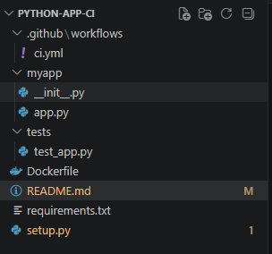
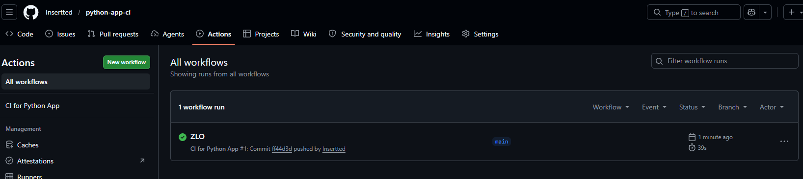
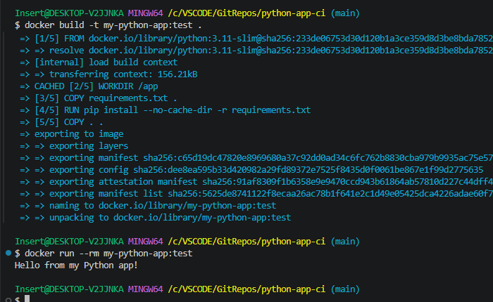

# python-app-ci

Цель — создать учебный пример CI для простого Python-приложения

CI (Continuous Integration - непрерывная интеграция)

Автоматически проверяет код при каждом push/PR:
линтинг (flake8) - автоматическая проверка исходного кода
тесты (pytest)
сборка Docker-образа для проверки (без публикации)

Структура:

Проверка работы через actions:

Сборка и запуск через докер файл:
